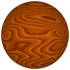
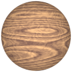
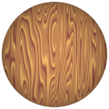

# TSL Textures


## wood
This texture attempts imitate the pattern of wood. Click on
a snapshot to open it online.

<p class="gallery">

	<a class="style-block nocaption" href="../online/wood.html?scale=2.5&rings=4.5&length=1&angle=0&fibers=0.3&fibersDensity=10&color=15182336&background=11163904&seed=0">
		
	</a>

	<a class="style-block nocaption" href="../online/wood.html?scale=1.959&rings=4.689&length=1&angle=0&fibers=0.26&fibersDensity=2.002&color=16573123&background=12165528&seed=5249">
		
	</a>

	<a class="style-block nocaption" href="../online/wood.html?scale=3.519&rings=4.059&length=3.339&angle=-88.2&fibers=0&fibersDensity=2&color=12883080&background=15717796&seed=5412">
		
	</a>

</p>


### Code example

```js
import { wood } from "tsl-textures/wood.js";

model.material.colorNode = wood ( {
	scale: 2.5,
	rings: 4.5,
	length: 1,
	angle: 0,
	fibers: 0.3,
	fibersDensity: 10,
	color: new THREE.Color(15182336),
	background: new THREE.Color(11163904),
	seed: 0
} );
```


### Parameters

* `scale` &ndash; level of details of the pattern, higher value generates finer details, [1, 4]
* `rings` &ndash; number of nested rings, [1, 10]
* `length` &ndash; length of the ring pattern, [1, 10]
* `angle` &ndash; angle of the ring pattern, in degrees, [-90, 90]
* `fibers` &ndash; visibility of fibers, [0, 1]
* `fibersDensity` &ndash; density of fibers, [2, 15]

* `color` &ndash; main color
* `background` &ndash; secondary color
* `seed` &ndash; number for the random generator, each value generates specific pattern


### Online generator

[online/wood.html](../online/wood.html)


### Source

[src/wood.js](https://github.com/boytchev/tsl-textures/blob/main/src/wood.js)


<div class="footnote">
	<a href="../">Home</a>
</div>