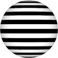
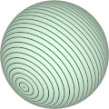

# TSL Textures


## Zebra lines

This texture renders a pattern of regularily spread lines
drawn as concentric circles around an axis. Zebra lines
 are used in the [zebra analysis](https://en.wikipedia.org/wiki/Zebra_analysis)
to examine the second derivative of smooth surface. The
generated texture is intended for spherical meshes. Click
on a snapshot to open it online.

<p class="gallery">

	<a class="style-block nocaption" href="../online/zebra-lines.html?scale=2&thinness=0.5&phi=0&theta=0&color=0&background=16777215">
		
	</a>

	<a class="style-block nocaption" href="../online/zebra-lines.html?scale=3.2&thinness=0.94&phi=0.94&theta=2.39&color=38213&background=15266795">
		
	</a>

	<a class="style-block nocaption" href="../online/zebra-lines.html?scale=0.92&thinness=0.52&phi=0.81&theta=1.63&color=9765003&background=16764662">
		
	</a>

</p>


### Code example

```js
import { zebraLines } from "tsl-textures";

model.material.colorNode = zebraLines ( {
	scale: 4,
	thinness: 0.76,
	phi: 1.51,
	theta: -6.283185307179586,
	color: new THREE.Color(0),
	background: new THREE.Color(16777215)
} );
```


### Parameters

* `position` &ndash; coordinates used to map texture, default is TSL `positionGeometry` node
* `scale` &ndash; level of details of the pattern, higher value generates finer details, [0, 4]
* `thinness` &ndash; thinness of lines, [0,1]
* `phi` &ndash; vertical angle &phi; of zebra lines axis, [0, &pi;]
* `theta` &ndash; horizontal angle &theta; of zebra lines axis, [-2&pi;, 2&pi;]
* `color` &ndash; color of lines
* `background` &ndash; color of background
* `flat` &ndash; secret flag, if 0 the texture is for a sphere, if 1 the texture is for a plane


### Online generator

[online/zebra-lines.html](../online/zebra-lines.html)


### Source

[src/patterns/zebra-lines.js](https://github.com/boytchev/tsl-textures/blob/main/src/zebra-lines.js)


		
<div class="footnote">
	<a href="../">Home</a>
</div>
